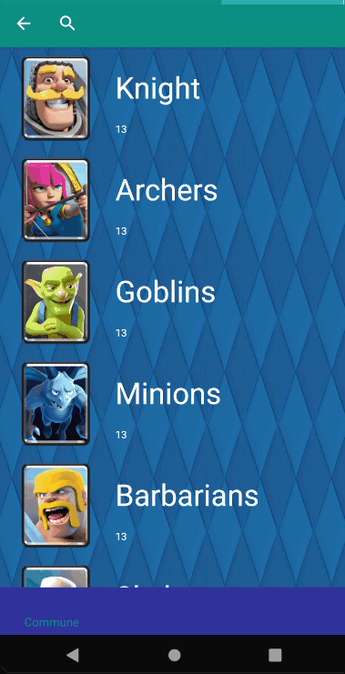

# Projet java 4A
### Ce projet java est un projet pour valider mon année de 4A à l'esiea, ayant pour thème les cartes de clash royale.
## Ce qu'il devait contenir
 - Des fragments
 - Une api
 - le mettre sur github
 - architecture MVC
## Ce qu'il contient en plus
 - RecyclerView
 - SearchView
 - Bottom-bar
## Example d'utilisation

## Description
Des le lancement de la MainActivity, l'api est chargé dans un MainController puis affiche une recyclerView composé d'elements contenant :
 - Une image
 - un titre
 - le niveau maximum du personnage
Les cartes ne sont pas toutes affichées, mais uniquement celon la rareté de la carte. La rareté peut être changé dans la bottom-bar